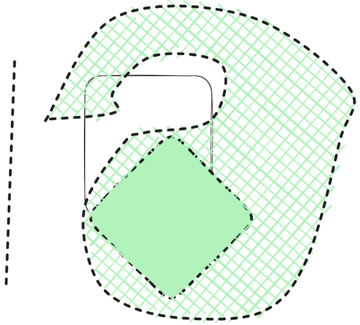

> Consider an inertial frame $S$ with coordinates $x^\mu = (t, x, y, z)$, and a frame $S'$ with coordinates $x^{\mu'}$ related to $S$ by a boost with velocity parameter $v$ along the y-axis.
> Imagine we have a wall at rest in $S'$, lying along the line $x' = -y'$. From the point of view of $S$, what is the relationship between the incident angle of a ball hitting the wall (traveling in the $x$-$y$ plane) and the reflected angle? What about the velocity before and after?

Let's start with the wall: consider a rod of length $1$ from point $(1, 0)$ to $(0, 0)$ in $S'$. Being orthogonal to the motion of $S'$ _wrt_ to $S$, it is not affected by contraction and has length $1$ in $S$ as well. On the other hand, a rod of length $1$ between $(1, 0)$ and $(1, -1)$ in $S'$ is parallel to the motion and is contracted in $S$ by a factor $\gamma = (1 - v^2)^{-\frac 12}$. Therefore, in $S$, the wall is not alligned with $y = -x$ but with $y = - (1 / \gamma)\, x$ and it is orthogonal to the vector $\vec n = \langle 1, \gamma \rangle$. 



Suppose that the ball is moving, seen by $S$, with velocity $\vec u = \langle u_x, u_y\rangle$ and it hits the wall at $t = 0$ in the origin $(0, 0)$. By $S$ measures, the angle on incidence $\theta_{\mathrm{in}}$ is such that $$\cos{\theta_\mathrm{in}} = \frac{- \vec u \cdot \vec n}{\Vert \vec u \Vert \; \Vert \vec n \Vert}$$

![[Drawing 2023-10-17 11.17.44.excalidraw 1|800]]

The ball has a four-velocity $u^\mu = \langle 1/\sqrt{1 - u^2}, u_x / \sqrt{1 - u^2}, u_y / \sqrt{1 - u^2}, 0 \rangle$ (with $u = \Vert \vec u \Vert$ for brevity) and therefore has four-velocity in $S'$ equal to $$u^{\mu '} = {\Lambda ^{\mu'}} _\alpha u ^\alpha = \left( \begin{matrix}\gamma (1 - v \, u_y) / \sqrt{1 - u^2} \\ u_x / \sqrt{1 - u^2} \\ \gamma (-v + u_y) / \sqrt{1 - u^2} \\ 0 \end{matrix}\right)$$
So from the point of view of $S'$, the ball has a velocity $$ \vec u ' = \begin{pmatrix} \frac{u_x}{\gamma (1 - v u_y)} \\ \frac{-v +u_y}{1 - v u_y}\end{pmatrix} $$ which after the hit gets reflected into $$ \vec w ' = \begin{pmatrix}\frac{v - u_y}{1 - v u_y} \\  \frac{- u_x}{\gamma (1 - v u_y)}\end{pmatrix} $$ corresponding to a four-velocity $$w^{\mu '} = \left( \begin{matrix}\gamma (1 - v \, u_y) / \sqrt{1 - u^2} \\ \gamma (v - u_y) / \sqrt{1 - u^2} \\ -u_x / \sqrt{1 - u^2} \\ 0 \end{matrix}\right)$$. That four-velocity, seem by $S$ is $$ w^{\mu} = {\Lambda ^{\mu}} _{\alpha'} w ^{\alpha'} = \begin{pmatrix} \gamma^2 (1 - v u_y) / \sqrt{1 - u^2} - \gamma v u_x / \sqrt{1 - u^2} \\ \gamma (v - u_y) / \sqrt{1 - u^2} \\ \gamma^2 (1 - v u_y) / \sqrt{1 - u^2} - \gamma u_x  / \sqrt{1 - u^2} \\ 0\end{pmatrix}$$ and it correspond to a velocity $$ \vec{w} = \begin{pmatrix} \frac{v - u_y}{\gamma - \gamma v u_y - v u_x} \\ \frac{\gamma v - \gamma v^2 u_y - u_x}{\gamma - \gamma v u_y - v u_x} \end{pmatrix} $$

```python
import micropip
await micropip.install('sympy')  
from sympy import *

def velocity_to_fourvelocity(v):
	vx = v[0,0]
	vy = v[1, 0]
	vz = v[2, 0]
	mod_v = sqrt(vx**2 + vy**2 + vz**2)
	gamma = 1 / sqrt(1 - mod_v**2)
	return Matrix([gamma, gamma*vx, gamma*vy, gamma*vz])

def fourvelocity_to_velocity(f):
	gamma = f[0, 0]
	return Matrix([f[1, 0] / gamma, f[2, 0] / gamma, f[3, 0] / gamma])

def scalar(u, v):
	return simplify(u[0, 0]*v[0, 0] + u[1, 0]*v[1, 0] + u[2, 0]*v[2, 0])

def modulo(v):
	return simplify(sqrt(scalar(v, v)))

def cross(u, v):
	return Matrix([
		+ u[1, 0]*v[2, 0] - u[2, 0]*v[1, 0],
		- u[0, 0]*v[2, 0] + u[2, 0]*v[0, 0],
		+ u[0, 0]*v[1, 0] - u[1, 0]*v[0, 0],
	])

def cosine(u, v):
	return scalar(u, v) / (modulo(u) * modulo(v))


def sine(u, v):
	return simplify(modulo(cross(u, v)) / (modulo(u) * modulo(v)))

def tangent_on_xy(u, v):
	assert u[2, 0] == v[2, 0] == 0
	return simplify((u[0, 0]*v[1, 0] - u[1, 0]*v[0, 0] )/ scalar(u, v))


	


t, x, y, z = symbols("t, x, y, z", real=True)
v, ux, uy = symbols("v, u_x, u_y", real=True)
gamma = symbols("gamma", real=True)
#gamma = 1 / sqrt(1 - v**2)
n = Matrix([ 1, gamma, 0 ])
u = Matrix([ ux, uy, 0])

fu = velocity_to_fourvelocity(u)

L = Matrix([
	[gamma, 0, -gamma * v, 0],
	[0, 1, 0, 0],
	[-gamma*v, 0, gamma, 0],
	[0, 0, 0, 1]
])
invL = L**-1

fu_prime = simplify(L * fu)
u_prime = fourvelocity_to_velocity(fu_prime)

w_prime = Matrix([ -u_prime[1, 0], -u_prime[0, 0], u_prime[2, 0]])
fw_prime = velocity_to_fourvelocity(w_prime)

fw = invL * fw_prime
w = fourvelocity_to_velocity(fw)
w = simplify(w)

tan_in = simplify(tangent_on_xy(-u, n))
tan_out = simplify(tangent_on_xy(w, n))
print(latex(simplify(tan_out / tan_in)))
```

$$
- \frac{\left(\gamma u_{y} + u_{x}\right) \left(\gamma^{3} u_{y} v^{2} - \gamma^{3} u_{y} - \gamma^{3} v^{3} + \gamma^{3} v + \gamma u_{y} v^{2} - \gamma v + u_{x}\right)}{\gamma \left(\gamma u_{x} - u_{y}\right) \left(\gamma u_{y} + \gamma v^{3} - 2 \gamma v + u_{x}\right)}
$$
```python 
expr = expand(tan_out / tan_in)
print(latex(expr))
expr = simplify(expr.subs(gamma**3, gamma / (1 - v**2)))
print(latex(expr))
```
$$
\frac{\gamma^{4} u_{y}^{2} v^{4} - 2 \gamma^{4} u_{y}^{2} v^{2} + \gamma^{4} u_{y}^{2} - \gamma^{4} u_{y} v^{5} + 2 \gamma^{4} u_{y} v^{3} - \gamma^{4} u_{y} v + \gamma^{2} u_{y}^{2} v^{4} - \gamma^{2} u_{y}^{2} v^{2} - \gamma^{2} u_{y} v^{3} + \gamma^{2} u_{y} v + \gamma u_{x} u_{y} v^{4} - \gamma u_{x} u_{y} v^{2} + u_{x}^{2} v^{2} - u_{x}^{2}}{\gamma \left(- \gamma u_{x}^{2} v^{2} + \gamma u_{x}^{2} + \gamma u_{y}^{2} v^{2} - \gamma u_{y}^{2} + \gamma u_{y} v^{5} - 3 \gamma u_{y} v^{3} + 2 \gamma u_{y} v + u_{x} u_{y} v^{2} + u_{x} v^{3} - 2 u_{x} v\right)}
$$
```python
expr = expand(expr.subs(v**2 - 1, -1/gamma**2))
print(latex(expr))
```
$$
- \frac{\gamma^{4} u_{y}^{2} v^{2}}{\gamma^{3} u_{x} u_{y} + \gamma^{3} u_{x} v^{3} - 2 \gamma^{3} u_{x} v + \gamma^{2} u_{x}^{2} - \gamma^{2} u_{y}^{2} - \gamma^{2} u_{y} v^{3} + 2 \gamma^{2} u_{y} v - \gamma u_{x} u_{y}} + \frac{\gamma^{4} u_{y}^{2}}{\gamma^{3} u_{x} u_{y} + \gamma^{3} u_{x} v^{3} - 2 \gamma^{3} u_{x} v + \gamma^{2} u_{x}^{2} - \gamma^{2} u_{y}^{2} - \gamma^{2} u_{y} v^{3} + 2 \gamma^{2} u_{y} v - \gamma u_{x} u_{y}} + \frac{\gamma^{4} u_{y} v^{3}}{\gamma^{3} u_{x} u_{y} + \gamma^{3} u_{x} v^{3} - 2 \gamma^{3} u_{x} v + \gamma^{2} u_{x}^{2} - \gamma^{2} u_{y}^{2} - \gamma^{2} u_{y} v^{3} + 2 \gamma^{2} u_{y} v - \gamma u_{x} u_{y}} - \frac{\gamma^{4} u_{y} v}{\gamma^{3} u_{x} u_{y} + \gamma^{3} u_{x} v^{3} - 2 \gamma^{3} u_{x} v + \gamma^{2} u_{x}^{2} - \gamma^{2} u_{y}^{2} - \gamma^{2} u_{y} v^{3} + 2 \gamma^{2} u_{y} v - \gamma u_{x} u_{y}} - \frac{\gamma^{3} u_{x} u_{y} v^{2}}{\gamma^{3} u_{x} u_{y} + \gamma^{3} u_{x} v^{3} - 2 \gamma^{3} u_{x} v + \gamma^{2} u_{x}^{2} - \gamma^{2} u_{y}^{2} - \gamma^{2} u_{y} v^{3} + 2 \gamma^{2} u_{y} v - \gamma u_{x} u_{y}} + \frac{\gamma^{3} u_{x} u_{y}}{\gamma^{3} u_{x} u_{y} + \gamma^{3} u_{x} v^{3} - 2 \gamma^{3} u_{x} v + \gamma^{2} u_{x}^{2} - \gamma^{2} u_{y}^{2} - \gamma^{2} u_{y} v^{3} + 2 \gamma^{2} u_{y} v - \gamma u_{x} u_{y}} + \frac{\gamma^{3} u_{x} v^{3}}{\gamma^{3} u_{x} u_{y} + \gamma^{3} u_{x} v^{3} - 2 \gamma^{3} u_{x} v + \gamma^{2} u_{x}^{2} - \gamma^{2} u_{y}^{2} - \gamma^{2} u_{y} v^{3} + 2 \gamma^{2} u_{y} v - \gamma u_{x} u_{y}} - \frac{\gamma^{3} u_{x} v}{\gamma^{3} u_{x} u_{y} + \gamma^{3} u_{x} v^{3} - 2 \gamma^{3} u_{x} v + \gamma^{2} u_{x}^{2} - \gamma^{2} u_{y}^{2} - \gamma^{2} u_{y} v^{3} + 2 \gamma^{2} u_{y} v - \gamma u_{x} u_{y}} - \frac{\gamma^{2} u_{y}^{2} v^{2}}{\gamma^{3} u_{x} u_{y} + \gamma^{3} u_{x} v^{3} - 2 \gamma^{3} u_{x} v + \gamma^{2} u_{x}^{2} - \gamma^{2} u_{y}^{2} - \gamma^{2} u_{y} v^{3} + 2 \gamma^{2} u_{y} v - \gamma u_{x} u_{y}} + \frac{\gamma^{2} u_{y} v}{\gamma^{3} u_{x} u_{y} + \gamma^{3} u_{x} v^{3} - 2 \gamma^{3} u_{x} v + \gamma^{2} u_{x}^{2} - \gamma^{2} u_{y}^{2} - \gamma^{2} u_{y} v^{3} + 2 \gamma^{2} u_{y} v - \gamma u_{x} u_{y}} - \frac{\gamma u_{x} u_{y} v^{2}}{\gamma^{3} u_{x} u_{y} + \gamma^{3} u_{x} v^{3} - 2 \gamma^{3} u_{x} v + \gamma^{2} u_{x}^{2} - \gamma^{2} u_{y}^{2} - \gamma^{2} u_{y} v^{3} + 2 \gamma^{2} u_{y} v - \gamma u_{x} u_{y}} - \frac{\gamma u_{x} u_{y}}{\gamma^{3} u_{x} u_{y} + \gamma^{3} u_{x} v^{3} - 2 \gamma^{3} u_{x} v + \gamma^{2} u_{x}^{2} - \gamma^{2} u_{y}^{2} - \gamma^{2} u_{y} v^{3} + 2 \gamma^{2} u_{y} v - \gamma u_{x} u_{y}} + \frac{\gamma u_{x} v}{\gamma^{3} u_{x} u_{y} + \gamma^{3} u_{x} v^{3} - 2 \gamma^{3} u_{x} v + \gamma^{2} u_{x}^{2} - \gamma^{2} u_{y}^{2} - \gamma^{2} u_{y} v^{3} + 2 \gamma^{2} u_{y} v - \gamma u_{x} u_{y}} - \frac{u_{x}^{2}}{\gamma^{3} u_{x} u_{y} + \gamma^{3} u_{x} v^{3} - 2 \gamma^{3} u_{x} v + \gamma^{2} u_{x}^{2} - \gamma^{2} u_{y}^{2} - \gamma^{2} u_{y} v^{3} + 2 \gamma^{2} u_{y} v - \gamma u_{x} u_{y}}
$$
